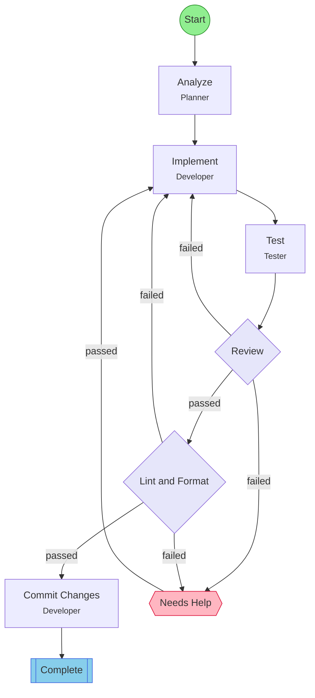

## Workflow: Agile Task

Simple workflow for general development tasks: analyze, implement, test, review.

### Diagram

### Step Instructions

| Stage | Step | Name | Agent | Instructions |
|-------|------|------|-------|--------------|
| planning | analyze | Analyze | flow:Planner | Understand requirements and plan approach |
| development | implement | Implement | flow:Developer | Write the code or make changes |
| verification | test | Test | flow:Tester | Verify the implementation works correctly |
| verification | review | Review | flow:Reviewer | Review code quality and correctness |
| delivery | lint_format | Lint & Format | flow:Developer | Run lint and format checks. Auto-fix issues where possible. |
| delivery | commit | Commit Changes | flow:Developer | Commit all changes with a descriptive message |
