## Workflow: Agile Task

Simple workflow for general development tasks: analyze, implement, test, review.

### Diagram

```mermaid
flowchart TD
    start(("Start"))
    analyze["Analyze<br/><small>📋 Planner</small>"]
    implement["Implement<br/><small>🔧 Developer</small>"]
    test["Test<br/><small>🧪 Tester</small>"]
    review{"Review<br/><small>👀 Reviewer</small>"}
    lint_format{"Lint and Format<br/><small>🔧 Developer</small>"}
    commit["Commit Changes<br/><small>🔧 Developer</small>"]
    end_success[["Complete"]]
    hitl_failed{{"✋ Needs Help"}}

    start --> analyze
    analyze --> implement
    implement --> test
    test --> review
    review -->|Fix issues found in review| implement
    review -->|Too many review failures| hitl_failed
    review -->|Review passed, run lint checks| lint_format
    lint_format -->|Lint passes, commit changes| commit
    lint_format -->|Fix lint/format issues| implement
    lint_format -->|Lint issues persist| hitl_failed
    commit --> end_success
    hitl_failed -->|Human resolved issue, resume| implement

    classDef startStep fill:#90EE90,stroke:#228B22
    classDef successStep fill:#87CEEB,stroke:#4169E1
    classDef hitlStep fill:#FFB6C1,stroke:#DC143C
    classDef gateStep fill:#E6E6FA,stroke:#9370DB
    classDef forkJoinStep fill:#FFEAA7,stroke:#FDCB6E
    classDef currentStep fill:#FFD700,stroke:#FF8C00,stroke-width:3px
    class start startStep
    class end_success successStep
    class hitl_failed hitlStep
    class review,lint_format gateStep
```

### Step Instructions

| Stage | Step | Name | Agent | Instructions |
|-------|------|------|-------|--------------|
| planning | analyze | Analyze | 📋 flow:Planner | Understand requirements and plan approach |
| development | implement | Implement | 🔧 flow:Developer | Write the code or make changes |
| verification | test | Test | 🧪 flow:Tester | Verify the implementation works correctly |
| verification | review | Review | 👀 flow:Reviewer | Review code quality and correctness |
| delivery | lint_format | Lint & Format | 🔧 flow:Developer | Run lint and format checks. Auto-fix issues where possible. |
| delivery | commit | Commit Changes | 🔧 flow:Developer | Commit all changes with a descriptive message |
