## Workflow: Batch Process

Dynamic fork/join workflow for processing multiple items. The orchestrator spawns N tasks from a single branch template, throttled by maxConcurrency.

### Diagram

```mermaid
flowchart TD
    start(("Start"))
    analyze_items["Analyze Items<br/><small>📋 Planner</small>"]
    fork_process(["Fork Process"])
    process_item["Process Item<br/><small>🔧 Developer</small>"]
    join_process(["Join Process"])
    summarize["Summarize Results<br/><small>🏛️ Architect</small>"]
    end_success[["Batch Complete"]]
    hitl_partial{{"✋ Partial Failure"}}

    start --> analyze_items
    analyze_items -->|passed| fork_process
    fork_process -->|Process a single item from the batch| process_item
    process_item --> join_process
    join_process -->|All items processed| summarize
    join_process -->|Some items failed| hitl_partial
    summarize --> end_success
    hitl_partial -->|Human resolved - retry failed items| fork_process

    classDef startStep fill:#90EE90,stroke:#228B22
    classDef successStep fill:#87CEEB,stroke:#4169E1
    classDef hitlStep fill:#FFB6C1,stroke:#DC143C
    classDef gateStep fill:#E6E6FA,stroke:#9370DB
    classDef forkJoinStep fill:#FFEAA7,stroke:#FDCB6E
    classDef currentStep fill:#FFD700,stroke:#FF8C00,stroke-width:3px
    class start startStep
    class end_success successStep
    class hitl_partial hitlStep
    class fork_process,join_process forkJoinStep
```

### Step Instructions

| Stage       | Step          | Name              | Agent        | Instructions                                                                                                                 |
| ----------- | ------------- | ----------------- | ------------ | ---------------------------------------------------------------------------------------------------------------------------- |
| planning    | analyze_items | Analyze Items     | 📋 Planner   | Parse the user's input to extract the list of items to process. Return a structured list.                                    |
| development | process_item  | Process Item      | 🔧 Developer | Process a single item. The item context is provided by the orchestrator. Analyze, transform, or validate the item as needed. |
| planning    | summarize     | Summarize Results | 🏛️ Architect | Combine results from all processed items into a final summary report.                                                        |
