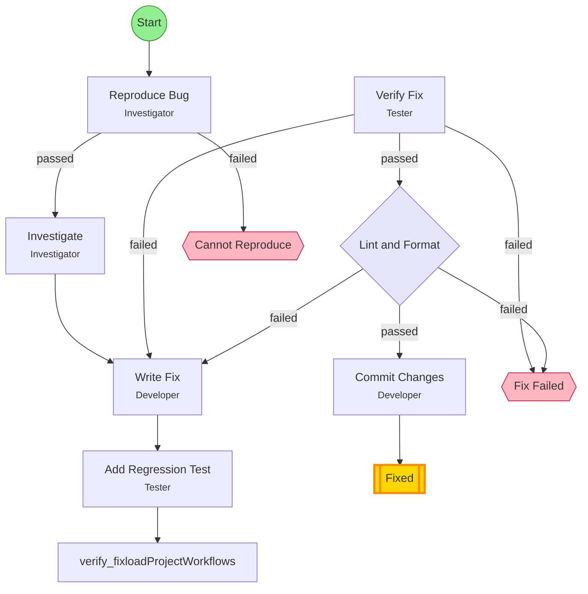

## Workflow: Bug Fix

Workflow for fixing bugs: reproduce, investigate, fix, verify, and create PR.

### Diagram

### Step Instructions

| Stage         | Step                | Name                | Agent              | Instructions                                                  |
| ------------- | ------------------- | ------------------- | ------------------ | ------------------------------------------------------------- |
| investigation | reproduce           | Reproduce Bug       | @flow:Investigator | Understand the bug and create a reliable reproduction case    |
| investigation | investigate         | Investigate         | @flow:Investigator | Find root cause by tracing code paths and debugging           |
| development   | write_fix           | Write Fix           | @flow:Developer    | Implement the fix with minimal changes                        |
| development   | add_regression_test | Add Regression Test | @flow:Tester       | Write a test that would have caught this bug                  |
| verification  | verify_fix          | Verify Fix          | @flow:Tester       | Run all tests and verify the bug is fixed                     |
| delivery      | lint_format         | Lint & Format       | @flow:Developer    | Run lint and format checks. Auto-fix issues where possible.   |
| delivery      | commit              | Commit Changes      | @flow:Developer    | Commit the fix and regression test with a descriptive message |
