## Workflow: Bug Fix

Workflow for fixing bugs: reproduce, investigate, fix, verify, and create PR.

### Diagram

```mermaid
flowchart TD
    start(("Start"))
    reproduce["Reproduce Bug<br/><small>🔍 Investigator</small>"]
    investigate["Investigate<br/><small>🔍 Investigator</small>"]
    write_fix["Write Fix<br/><small>🔧 Developer</small>"]
    add_regression_test["Add Regression Test<br/><small>🧪 Tester</small>"]
    verify_fix["Verify Fix<br/><small>🧪 Tester ↻3</small>"]
    lint_format{"Lint and Format<br/><small>🔧 Developer ↻3</small>"}
    commit["Commit Changes<br/><small>🔧 Developer</small>"]
    end_success[["Fixed"]]
    hitl_cannot_reproduce{{"✋ Cannot Reproduce"}}
    hitl_fix_failed{{"✋ Fix Failed"}}

    start --> reproduce
    reproduce -->|Bug reproduced successfully| investigate
    reproduce -->|Could not reproduce bug| hitl_cannot_reproduce
    investigate --> write_fix
    write_fix --> add_regression_test
    add_regression_test --> verify_fix
    verify_fix -->|Fix didn't work, try again| write_fix
    verify_fix -->|Cannot fix the bug| hitl_fix_failed
    verify_fix -->|Bug verified fixed, run lint checks| lint_format
    lint_format -->|Lint passes, commit changes| commit
    lint_format -->|Fix lint/format issues| write_fix
    lint_format -->|Lint issues persist| hitl_fix_failed
    commit --> end_success
    hitl_cannot_reproduce -->|Human provided reproduction info, resume| reproduce
    hitl_fix_failed -->|Human resolved fix issue, resume| write_fix

    classDef startStep fill:#90EE90,stroke:#228B22
    classDef successStep fill:#87CEEB,stroke:#4169E1
    classDef hitlStep fill:#FFB6C1,stroke:#DC143C
    classDef gateStep fill:#E6E6FA,stroke:#9370DB
    classDef forkJoinStep fill:#FFEAA7,stroke:#FDCB6E
    classDef currentStep fill:#FFD700,stroke:#FF8C00,stroke-width:3px
    class start startStep
    class end_success successStep
    class hitl_cannot_reproduce,hitl_fix_failed hitlStep
    class lint_format gateStep
    class verify_fix currentStep
```

### Step Instructions

| Stage         | Step                | Name                | Agent           | Instructions                                                  |
| ------------- | ------------------- | ------------------- | --------------- | ------------------------------------------------------------- |
| investigation | reproduce           | Reproduce Bug       | 🔍 Investigator | Understand the bug and create a reliable reproduction case    |
| investigation | investigate         | Investigate         | 🔍 Investigator | Find root cause by tracing code paths and debugging           |
| development   | write_fix           | Write Fix           | 🔧 Developer    | Implement the fix with minimal changes                        |
| development   | add_regression_test | Add Regression Test | 🧪 Tester       | Write a test that would have caught this bug                  |
| verification  | verify_fix          | Verify Fix          | 🧪 Tester       | Run all tests and verify the bug is fixed                     |
| delivery      | lint_format         | Lint & Format       | 🔧 Developer    | Run lint and format checks. Auto-fix issues where possible.   |
| delivery      | commit              | Commit Changes      | 🔧 Developer    | Commit the fix and regression test with a descriptive message |
