## Workflow: Bug Hunt

Parallel investigation workflow for vague bug reports. Fans out into reproduction, code archaeology, and git forensics tracks, then synthesizes findings into a root cause analysis and fix.

### Diagram

```mermaid
flowchart TD
    start(("Start"))
    triage["Triage Report<br/><small>🔍 Investigator</small>"]
    fork_investigate(["Fork Investigation"])
    reproduce["Reproduce Bug<br/><small>🧪 Tester</small>"]
    code_archaeology["Code Archaeology<br/><small>🔍 Investigator</small>"]
    git_forensics["Git Forensics<br/><small>🔍 Investigator</small>"]
    join_investigate(["Join Investigation"])
    synthesize["Synthesize Findings<br/><small>🏛️ Architect</small>"]
    write_fix["Write Fix<br/><small>🔧 Developer</small>"]
    add_regression_test["Add Regression Test<br/><small>🧪 Tester</small>"]
    verify_fix{"Verify Fix<br/><small>🧪 Tester ↻3</small>"}
    lint_format{"Lint and Format<br/><small>🔧 Developer ↻3</small>"}
    commit["Commit Changes<br/><small>🔧 Developer</small>"]
    end_success[["Bug Fixed"]]
    hitl_inconclusive{{"✋ Inconclusive"}}
    hitl_fix_failed{{"✋ Fix Failed"}}

    start --> triage
    triage --> fork_investigate
    fork_investigate -->|Try to trigger the bug| reproduce
    fork_investigate -->|Trace code paths related to symptoms| code_archaeology
    fork_investigate -->|Check recent commits and git blame| git_forensics
    reproduce --> join_investigate
    code_archaeology --> join_investigate
    git_forensics --> join_investigate
    join_investigate -->|All tracks complete| synthesize
    join_investigate -->|Investigation couldn't determine root cause| hitl_inconclusive
    synthesize --> write_fix
    write_fix --> add_regression_test
    add_regression_test --> verify_fix
    verify_fix -->|Fix verified, run lint checks| lint_format
    verify_fix -->|Fix didn't work, try again| write_fix
    verify_fix -->|Cannot fix the bug| hitl_fix_failed
    lint_format -->|Lint passes, commit changes| commit
    lint_format -->|Fix lint/format issues| write_fix
    lint_format -->|Lint issues persist| hitl_fix_failed
    commit --> end_success
    hitl_inconclusive -->|Human provided context, re-triage| triage
    hitl_fix_failed -->|Human resolved issue, resume fix| write_fix

    classDef startStep fill:#90EE90,stroke:#228B22
    classDef successStep fill:#87CEEB,stroke:#4169E1
    classDef hitlStep fill:#FFB6C1,stroke:#DC143C
    classDef gateStep fill:#E6E6FA,stroke:#9370DB
    classDef forkJoinStep fill:#FFEAA7,stroke:#FDCB6E
    classDef currentStep fill:#FFD700,stroke:#FF8C00,stroke-width:3px
    class start startStep
    class end_success successStep
    class hitl_inconclusive,hitl_fix_failed hitlStep
    class verify_fix,lint_format gateStep
    class fork_investigate,join_investigate forkJoinStep
```

### Step Instructions

| Stage         | Step                | Name                | Agent           | Instructions                                                                                                                                        |
| ------------- | ------------------- | ------------------- | --------------- | --------------------------------------------------------------------------------------------------------------------------------------------------- |
| planning      | triage              | Triage Report       | 🔍 Investigator | Parse the vague report. Extract symptoms, affected area, timing, severity. Form 2-3 hypotheses to test.                                             |
| investigation | reproduce           | Reproduce Bug       | 🧪 Tester       | Try to trigger the bug. Document exact reproduction steps, environment, and observed vs expected behavior.                                          |
| investigation | code_archaeology    | Code Archaeology    | 🔍 Investigator | Trace the code paths related to the reported symptoms. Map data flow, identify suspect modules, check edge cases.                                   |
| investigation | git_forensics       | Git Forensics       | 🔍 Investigator | Check recent commits touching affected areas. Run git blame on suspect files. Look for correlated changes or regressions.                           |
| planning      | synthesize          | Synthesize Findings | 🏛️ Architect    | Combine findings from all investigation tracks into a root cause analysis. Identify the most likely cause, supporting evidence, and a fix strategy. |
| development   | write_fix           | Write Fix           | 🔧 Developer    | Implement the fix with minimal changes                                                                                                              |
| development   | add_regression_test | Add Regression Test | 🧪 Tester       | Write a test that would have caught this bug                                                                                                        |
| verification  | verify_fix          | Verify Fix          | 🧪 Tester       | Run tests, verify fix addresses root cause                                                                                                          |
| delivery      | lint_format         | Lint & Format       | 🔧 Developer    | Run lint and format checks. Auto-fix issues where possible.                                                                                         |
| delivery      | commit              | Commit Changes      | 🔧 Developer    | Commit the fix and regression test with a descriptive message                                                                                       |
