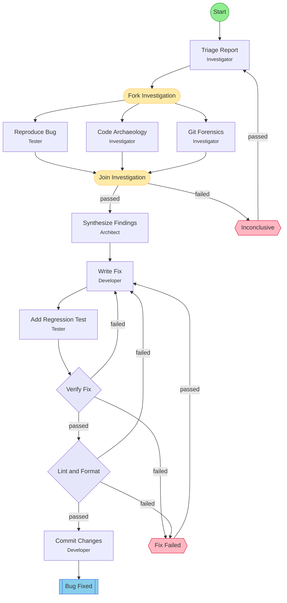

## Workflow: Bug Hunt

Parallel investigation workflow for vague bug reports. Fans out into reproduction, code archaeology, and git forensics tracks, then synthesizes findings into a root cause analysis and fix.

### Diagram

### Step Instructions

| Stage | Step | Name | Agent | Instructions |
|-------|------|------|-------|--------------|
| planning | triage | Triage Report | flow:Investigator | Parse the vague report. Extract symptoms, affected area, timing, severity. Form 2-3 hypotheses to test. |
| investigation | reproduce | Reproduce Bug | flow:Tester | Try to trigger the bug. Document exact reproduction steps, environment, and observed vs expected behavior. |
| investigation | code_archaeology | Code Archaeology | flow:Investigator | Trace the code paths related to the reported symptoms. Map data flow, identify suspect modules, check edge cases. |
| investigation | git_forensics | Git Forensics | flow:Investigator | Check recent commits touching affected areas. Run git blame on suspect files. Look for correlated changes or regressions. |
| planning | synthesize | Synthesize Findings | flow:Architect | Combine findings from all investigation tracks into a root cause analysis. Identify the most likely cause, supporting evidence, and a fix strategy. |
| development | write_fix | Write Fix | flow:Developer | Implement the fix with minimal changes |
| development | add_regression_test | Add Regression Test | flow:Tester | Write a test that would have caught this bug |
| verification | verify_fix | Verify Fix | flow:Tester | Run tests, verify fix addresses root cause |
| delivery | lint_format | Lint & Format | flow:Developer | Run lint and format checks. Auto-fix issues where possible. |
| delivery | commit | Commit Changes | flow:Developer | Commit the fix and regression test with a descriptive message |
