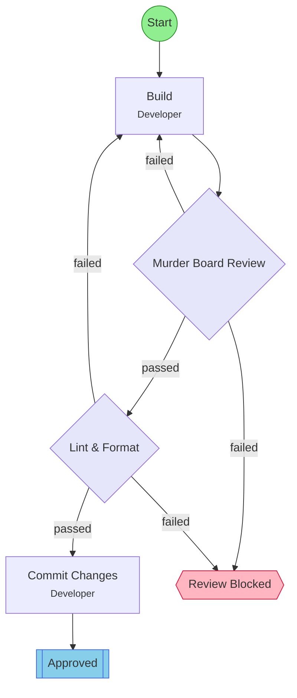

## Workflow: Build-Review Murder Board

High-scrutiny iterative build-review loop. A fresh reviewer agent tears apart each build attempt with maximum rigor. Ideal for critical changes requiring independent verification.

### Diagram

### Step Instructions

| Stage        | Step        | Name                | Agent           | Instructions                                                                                                                                    |
| ------------ | ----------- | ------------------- | --------------- | ----------------------------------------------------------------------------------------------------------------------------------------------- |
| development  | build       | Build               | @flow:Developer | Implement or revise the changes based on requirements or review feedback                                                                        |
| verification | review      | Murder Board Review | @flow:Reviewer  | Independent high-scrutiny review. Reviewer must be a fresh agent with no prior context of this build. Approval requires confidence score >= 80. |
| delivery     | lint_format | Lint & Format       | @flow:Developer | Run lint and format checks. Auto-fix issues where possible.                                                                                     |
| delivery     | commit      | Commit Changes      | @flow:Developer | Commit all changes with a descriptive message summarizing the work done                                                                         |
