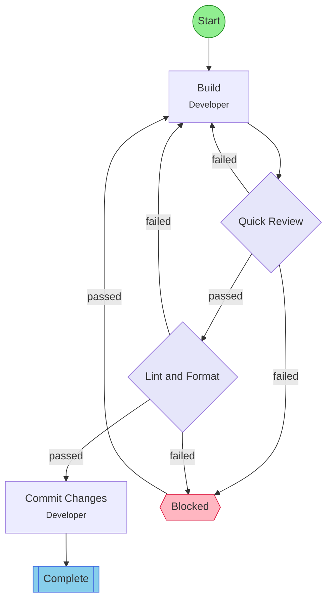

## Workflow: Build-Review Quick

Low-scrutiny iterative build-review loop. A lightweight review pass ensures basic correctness before delivery. Suited for low-risk or well-understood changes.

### Diagram

### Step Instructions

| Stage | Step | Name | Agent | Instructions |
|-------|------|------|-------|--------------|
| development | build | Build | Developer | Implement or revise the changes based on requirements or review feedback |
| verification | review | Quick Review | Reviewer | Lightweight review checking basic correctness and completeness |
| delivery | lint_format | Lint & Format | Developer | Run lint and format checks. Auto-fix issues where possible. |
| delivery | commit | Commit Changes | Developer | Commit all changes with a descriptive message summarizing the work done |