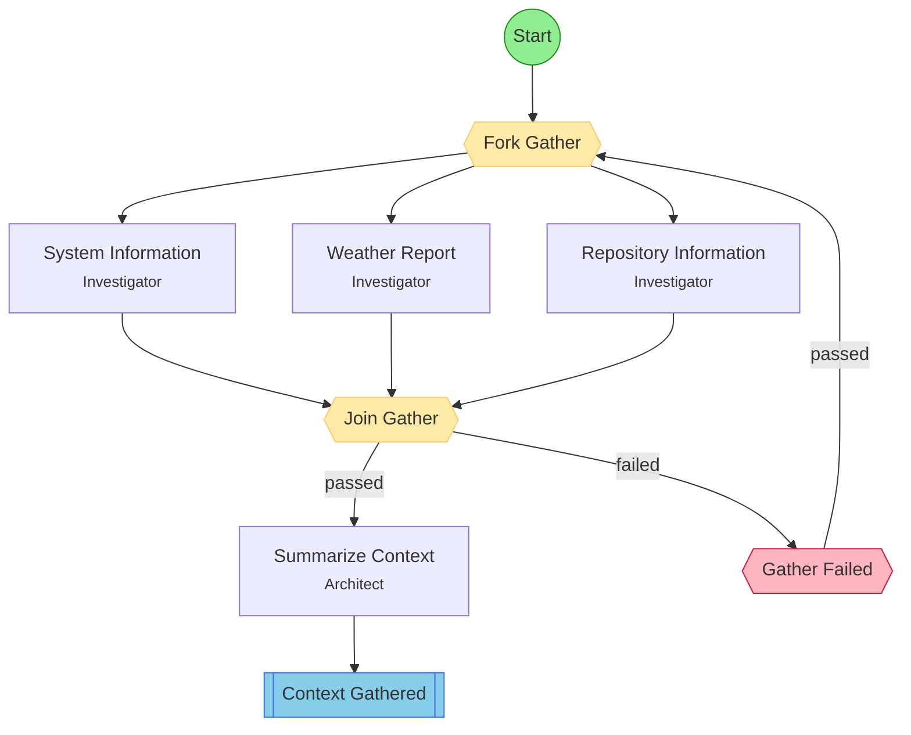

## Workflow: Context Gather

Toy workflow demonstrating fork/join. Fans out into three parallel information-gathering branches (system info, weather, repository), then synthesizes everything into a single summary.

### Diagram

### Step Instructions

| Stage | Step | Name | Agent | Instructions |
|-------|------|------|-------|--------------|
| investigation | system_info | System Information | Investigator | Gather system information: OS, architecture, CPU, memory, disk, shell, environment. Run uname, hostname, and similar commands. |
| investigation | weather_info | Weather Report | Investigator | Get today's weather at the user's location. Use a web search or weather API to find current conditions, temperature, and forecast. |
| investigation | repo_info | Repository Information | Investigator | Gather information about the current git repository: remote URL, branch, recent commits, language breakdown, directory structure overview, and package metadata. |
| planning | summarize | Summarize Context | Architect | Combine findings from all three branches into a single context summary. Present system info, weather, and repo info in a clear, readable format. |