## Workflow: Context Optimization

Workflow for optimizing agent context, instructions, and integration points. Use when improving how agents communicate and preserve state.

### Diagram

```mermaid
flowchart TD
    start(("Start"))
    map_connections["Map Connections<br/><small>🧠 Context Engineer</small>"]
    identify_pathologies["Identify Pathologies<br/><small>🧠 Context Engineer</small>"]
    design_improvements["Design Improvements<br/><small>🧠 Context Engineer</small>"]
    review_design{"Review Design<br/><small>👀 Reviewer ↻2</small>"}
    implement["Implement<br/><small>🔧 Developer</small>"]
    verify["Verify<br/><small>🧪 Tester ↻2</small>"]
    end_success[["Complete"]]
    hitl_design_failed{{"✋ Design Needs Help"}}
    hitl_verify_failed{{"✋ Verification Needs Help"}}

    start --> map_connections
    map_connections --> identify_pathologies
    identify_pathologies --> design_improvements
    design_improvements --> review_design
    review_design -->|Revise optimizations| design_improvements
    review_design -->|Design needs human input| hitl_design_failed
    review_design -->|Design approved| implement
    implement --> verify
    verify -->|Fix issues| implement
    verify -->|Verification failed| hitl_verify_failed
    verify -->|Optimization verified| end_success
    hitl_design_failed -->|Human resolved design issue, resume| design_improvements
    hitl_verify_failed -->|Human resolved verification issue, resume| implement

    classDef startStep fill:#90EE90,stroke:#228B22
    classDef successStep fill:#87CEEB,stroke:#4169E1
    classDef hitlStep fill:#FFB6C1,stroke:#DC143C
    classDef gateStep fill:#E6E6FA,stroke:#9370DB
    classDef forkJoinStep fill:#FFEAA7,stroke:#FDCB6E
    classDef currentStep fill:#FFD700,stroke:#FF8C00,stroke-width:3px
    class start startStep
    class end_success successStep
    class hitl_design_failed,hitl_verify_failed hitlStep
    class review_design gateStep
```

### Step Instructions

| Stage | Step | Name | Agent | Instructions |
|-------|------|------|-------|--------------|
| analysis | map_connections | Map Connections | 🧠 Context Engineer | Identify all connection points between components (MCP, skills, agents, subagents) |
| analysis | identify_pathologies | Identify Pathologies | 🧠 Context Engineer | Find context pathologies: specification bloat, attention dilution, redundant framing |
| design | design_improvements | Design Improvements | 🧠 Context Engineer | Apply compression techniques: lead with conclusions, causal chains, precise terminology |
| design | review_design | Review Design | 👀 Reviewer | Verify improvements don't sacrifice meaning for brevity |
| implementation | implement | Implement | 🔧 Developer | Apply the optimizations to actual files and configurations |
| verification | verify | Verify | 🧪 Tester | Test that agents still function correctly with optimized context |
