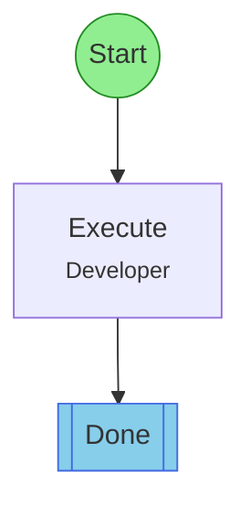

## Workflow: Execute

Single-step workflow. Just do the thing.

### Diagram

### Step Instructions

| Stage | Step | Name | Agent | Instructions |
|-------|------|------|-------|--------------|
| development | execute | Execute | flow:Developer | Do the work described in the task. |
