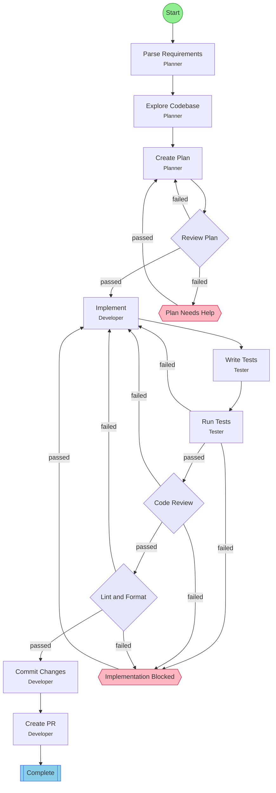

## Workflow: Feature Development

End-to-end workflow for building features from GitHub issues or requirements. Includes planning, implementation, testing, and PR creation.

### Diagram

### Step Instructions

| Stage | Step | Name | Agent | Instructions |
|-------|------|------|-------|--------------|
| planning | parse_requirements | Parse Requirements | Planner | Extract acceptance criteria and requirements from the issue or request |
| planning | explore_codebase | Explore Codebase | Planner | Find relevant files, understand patterns, identify where changes are needed |
| planning | create_plan | Create Plan | Planner | Write implementation plan with specific files and changes needed |
| planning | plan_review | Review Plan | Reviewer | Verify plan is complete and feasible |
| development | implement | Implement | Developer | Write the code following the plan |
| development | write_tests | Write Tests | Tester | Add unit and integration tests for the new feature |
| verification | run_tests | Run Tests | Tester | Execute test suite and verify all tests pass |
| verification | code_review | Code Review | Reviewer | Review code quality, patterns, and correctness |
| delivery | lint_format | Lint & Format | Developer | Run lint and format checks. Auto-fix issues where possible. |
| delivery | commit | Commit Changes | Developer | Commit all changes with a descriptive message summarizing the work done |
| delivery | create_pr | Create PR | Developer | Create pull request with summary and test plan |