## Workflow: Feature Development

End-to-end workflow for building features from GitHub issues or requirements. Includes planning, implementation, testing, and PR creation.

### Diagram

```mermaid
flowchart TD
    start(("Start"))
    parse_requirements["Parse Requirements<br/><small>📋 Planner</small>"]
    explore_codebase["Explore Codebase<br/><small>📋 Planner</small>"]
    create_plan["Create Plan<br/><small>📋 Planner</small>"]
    plan_review{"Review Plan<br/><small>👀 Reviewer ↻2</small>"}
    implement["Implement<br/><small>🔧 Developer</small>"]
    write_tests["Write Tests<br/><small>🧪 Tester</small>"]
    run_tests["Run Tests<br/><small>🧪 Tester ↻3</small>"]
    code_review{"Code Review<br/><small>👀 Reviewer ↻2</small>"}
    lint_format{"Lint and Format<br/><small>🔧 Developer ↻3</small>"}
    commit["Commit Changes<br/><small>🔧 Developer</small>"]
    create_pr["Create PR<br/><small>🔧 Developer</small>"]
    end_success[["Complete"]]
    hitl_plan_failed{{"✋ Plan Needs Help"}}
    hitl_impl_failed{{"✋ Implementation Blocked"}}

    start --> parse_requirements
    parse_requirements --> explore_codebase
    explore_codebase --> create_plan
    create_plan --> plan_review
    plan_review -->|Revise plan based on feedback| create_plan
    plan_review -->|Planning exhausted retries| hitl_plan_failed
    plan_review -->|Plan approved, begin implementation| implement
    implement --> write_tests
    write_tests --> run_tests
    run_tests -->|Fix failing tests| implement
    run_tests -->|Tests keep failing| hitl_impl_failed
    run_tests -->|Tests pass, ready for review| code_review
    code_review -->|Address review feedback| implement
    code_review -->|Review issues persist| hitl_impl_failed
    code_review -->|Code approved, run lint checks| lint_format
    lint_format -->|Lint passes, commit changes| commit
    lint_format -->|Fix lint/format issues| implement
    lint_format -->|Lint issues persist| hitl_impl_failed
    commit --> create_pr
    create_pr --> end_success
    hitl_plan_failed -->|Human resolved planning issue, resume| create_plan
    hitl_impl_failed -->|Human resolved implementation issue, resume| implement

    classDef startStep fill:#90EE90,stroke:#228B22
    classDef successStep fill:#87CEEB,stroke:#4169E1
    classDef hitlStep fill:#FFB6C1,stroke:#DC143C
    classDef gateStep fill:#E6E6FA,stroke:#9370DB
    classDef forkJoinStep fill:#FFEAA7,stroke:#FDCB6E
    classDef currentStep fill:#FFD700,stroke:#FF8C00,stroke-width:3px
    class start startStep
    class end_success successStep
    class hitl_plan_failed,hitl_impl_failed hitlStep
    class plan_review,code_review,lint_format gateStep
```

### Step Instructions

| Stage | Step | Name | Agent | Instructions |
|-------|------|------|-------|--------------|
| planning | parse_requirements | Parse Requirements | 📋 Planner | Extract acceptance criteria and requirements from the issue or request |
| planning | explore_codebase | Explore Codebase | 📋 Planner | Find relevant files, understand patterns, identify where changes are needed |
| planning | create_plan | Create Plan | 📋 Planner | Write implementation plan with specific files and changes needed |
| planning | plan_review | Review Plan | 👀 Reviewer | Verify plan is complete and feasible |
| development | implement | Implement | 🔧 Developer | Write the code following the plan |
| development | write_tests | Write Tests | 🧪 Tester | Add unit and integration tests for the new feature |
| verification | run_tests | Run Tests | 🧪 Tester | Execute test suite and verify all tests pass |
| verification | code_review | Code Review | 👀 Reviewer | Review code quality, patterns, and correctness |
| delivery | lint_format | Lint & Format | 🔧 Developer | Run lint and format checks. Auto-fix issues where possible. |
| delivery | commit | Commit Changes | 🔧 Developer | Commit all changes with a descriptive message summarizing the work done |
| delivery | create_pr | Create PR | 🔧 Developer | Create pull request with summary and test plan |
