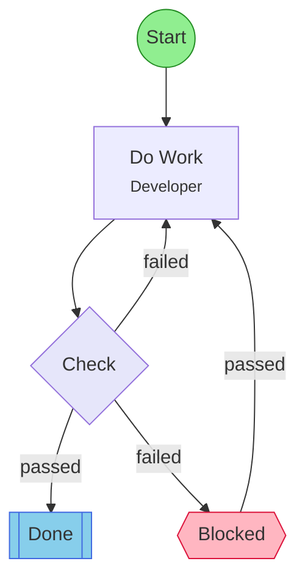

## Workflow: HITL Test

Minimal workflow for testing HITL recovery: work, gate, escalate, human resumes.

### Diagram

### Step Instructions

| Stage | Step | Name | Agent | Instructions |
|-------|------|------|-------|--------------|
| development | work | Do Work | Developer | Do the thing |
| verification | check | Check | Reviewer | Pass or fail |