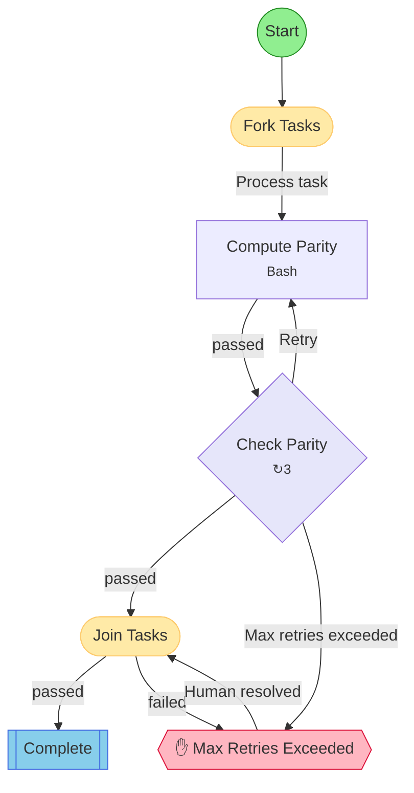

## Workflow: Odd/Even Test

Test workflow demonstrating fork with single branch, retry logic. Compute determines if task ID is odd/even, check fails odd tasks (with retries) and passes even tasks.

### Diagram

### Step Instructions

| Stage | Step | Name | Agent | Instructions |
|-------|------|------|-------|--------------|
| investigation | compute | Compute Parity | Bash | Determine if the task ID is odd or even. Store the result. |
| verification | check | Check Parity | - | Verify parity. FAIL if task ID is odd, PASS if task ID is even. |
