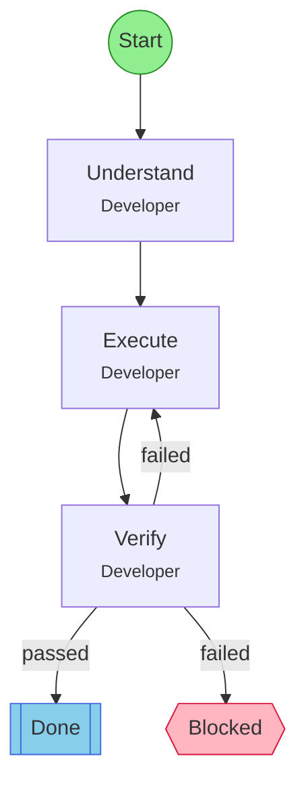

## Workflow: Quick Task

Minimal workflow for small, straightforward tasks. Understand, execute, verify - no formal review gates.

### Diagram

### Step Instructions

| Stage | Step | Name | Agent | Instructions |
|-------|------|------|-------|--------------|
| planning | understand | Understand | @flow:Developer | Clarify what needs to be done and identify the approach |
| development | execute | Execute | @flow:Developer | Make the changes or complete the work |
| verification | verify | Verify | @flow:Developer | Confirm the work is correct and complete |