## Workflow: Quick Task

Minimal workflow for small, straightforward tasks. Understand, execute, verify - no formal review gates.

### Diagram

```mermaid
flowchart TD
    start(("Start"))
    understand["Understand<br/><small>🔧 Developer</small>"]
    execute["Execute<br/><small>🔧 Developer</small>"]
    verify["Verify<br/><small>🔧 Developer</small>"]
    lint_format{"Lint and Format<br/><small>🔧 Developer</small>"}
    commit["Commit Changes<br/><small>🔧 Developer</small>"]
    end_success[["Done"]]
    hitl_blocked{{"✋ Blocked"}}

    start --> understand
    understand --> execute
    execute --> verify
    verify -->|passed| lint_format
    verify -->|Fix issues and try again| execute
    verify -->|Needs human help| hitl_blocked
    lint_format -->|Lint passes, commit changes| commit
    lint_format -->|Fix lint/format issues| execute
    lint_format -->|Lint issues persist| hitl_blocked
    commit --> end_success
    hitl_blocked -->|Human resolved issue, resume| execute

    classDef startStep fill:#90EE90,stroke:#228B22
    classDef successStep fill:#87CEEB,stroke:#4169E1
    classDef hitlStep fill:#FFB6C1,stroke:#DC143C
    classDef gateStep fill:#E6E6FA,stroke:#9370DB
    classDef forkJoinStep fill:#FFEAA7,stroke:#FDCB6E
    classDef currentStep fill:#FFD700,stroke:#FF8C00,stroke-width:3px
    class start startStep
    class end_success successStep
    class hitl_blocked hitlStep
    class lint_format gateStep
```

### Step Instructions

| Stage | Step | Name | Agent | Instructions |
|-------|------|------|-------|--------------|
| planning | understand | Understand | 🔧 flow:Developer | Clarify what needs to be done and identify the approach |
| development | execute | Execute | 🔧 flow:Developer | Make the changes or complete the work |
| verification | verify | Verify | 🔧 flow:Developer | Confirm the work is correct and complete |
| delivery | lint_format | Lint & Format | 🔧 flow:Developer | Run lint and format checks. Auto-fix issues where possible. |
| delivery | commit | Commit Changes | 🔧 flow:Developer | Commit all changes with a descriptive message |
