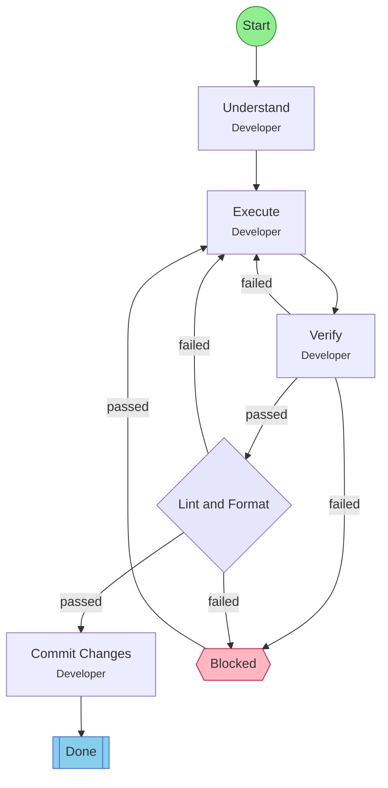

## Workflow: Quick Task

Minimal workflow for small, straightforward tasks. Understand, execute, verify - no formal review gates.

### Diagram

### Step Instructions

| Stage | Step | Name | Agent | Instructions |
|-------|------|------|-------|--------------|
| planning | understand | Understand | Developer | Clarify what needs to be done and identify the approach |
| development | execute | Execute | Developer | Make the changes or complete the work |
| verification | verify | Verify | Developer | Confirm the work is correct and complete |
| delivery | lint_format | Lint & Format | Developer | Run lint and format checks. Auto-fix issues where possible. |
| delivery | commit | Commit Changes | Developer | Commit all changes with a descriptive message |