## Workflow: Refactor

Transform outdated codebases into modern equivalents using Functional Core / Imperative Shell architecture. Separates pure business logic from side effects.

### Diagram

```mermaid
flowchart TD
    start(("Start"))
    analyze_structure["Analyze Structure<br/><small>📋 Planner</small>"]
    identify_debt["Identify Technical Debt<br/><small>📋 Planner</small>"]
    classify_components["Classify Components<br/><small>📋 Planner</small>"]
    design_refactor["Design Refactor Plan<br/><small>📋 Planner</small>"]
    plan_review{"Review Plan<br/><small>👀 Reviewer ↻2</small>"}
    extract_core["Extract Functional Core<br/><small>🔧 Developer</small>"]
    isolate_shell["Isolate Imperative Shell<br/><small>🔧 Developer</small>"]
    write_tests["Write Tests<br/><small>🧪 Tester</small>"]
    run_tests{"Run Tests<br/><small>🧪 Tester ↻3</small>"}
    code_review{"Code Review<br/><small>👀 Reviewer ↻2</small>"}
    lint_format{"Lint and Format<br/><small>🔧 Developer ↻3</small>"}
    commit["Commit Changes<br/><small>🔧 Developer</small>"]
    end_success[["Complete"]]
    hitl_analysis_failed{{"✋ Analysis Blocked"}}
    hitl_dev_failed{{"✋ Development Blocked"}}

    start --> analyze_structure
    analyze_structure --> identify_debt
    identify_debt --> classify_components
    classify_components --> design_refactor
    design_refactor --> plan_review
    plan_review -->|Revise plan based on feedback| design_refactor
    plan_review -->|Planning exhausted retries| hitl_analysis_failed
    plan_review -->|Plan approved, begin refactoring| extract_core
    extract_core --> isolate_shell
    isolate_shell --> write_tests
    write_tests --> run_tests
    run_tests -->|Fix failing tests| extract_core
    run_tests -->|Tests keep failing| hitl_dev_failed
    run_tests -->|Tests pass, ready for review| code_review
    code_review -->|Address review feedback| extract_core
    code_review -->|Review issues persist| hitl_dev_failed
    code_review -->|Code approved, run lint checks| lint_format
    lint_format -->|Lint passes, commit changes| commit
    lint_format -->|Fix lint/format issues| extract_core
    lint_format -->|Lint issues persist| hitl_dev_failed
    commit --> end_success
    hitl_analysis_failed -->|Human resolved analysis issue, resume| design_refactor
    hitl_dev_failed -->|Human resolved development issue, resume| extract_core

    classDef startStep fill:#90EE90,stroke:#228B22
    classDef successStep fill:#87CEEB,stroke:#4169E1
    classDef hitlStep fill:#FFB6C1,stroke:#DC143C
    classDef gateStep fill:#E6E6FA,stroke:#9370DB
    classDef forkJoinStep fill:#FFEAA7,stroke:#FDCB6E
    classDef currentStep fill:#FFD700,stroke:#FF8C00,stroke-width:3px
    class start startStep
    class end_success successStep
    class hitl_analysis_failed,hitl_dev_failed hitlStep
    class plan_review,run_tests,code_review,lint_format gateStep
```

### Step Instructions

| Stage | Step | Name | Agent | Instructions |
|-------|------|------|-------|--------------|
| analysis | analyze_structure | Analyze Structure | 📋 Planner | Map current architecture: modules, dependencies, entry points. Identify coupling and cohesion issues. |
| analysis | identify_debt | Identify Technical Debt | 📋 Planner | Find code smells, anti-patterns, outdated practices. Document violations of SOLID, DRY, and separation of concerns. |
| analysis | classify_components | Classify Components | 📋 Planner | Categorize code into Functional Core (pure logic, no side effects) vs Imperative Shell (I/O, state, external calls). |
| planning | design_refactor | Design Refactor Plan | 📋 Planner | Create transformation plan: define functional core boundaries, shell interfaces, and migration sequence. |
| planning | plan_review | Review Plan | 👀 Reviewer | Verify refactor plan maintains behavioral equivalence while achieving architectural goals. |
| development | extract_core | Extract Functional Core | 🔧 Developer | Refactor pure business logic into functional core: no side effects, deterministic, testable in isolation. |
| development | isolate_shell | Isolate Imperative Shell | 🔧 Developer | Wrap side effects (I/O, state, external services) in thin imperative shell that coordinates functional core. |
| development | write_tests | Write Tests | 🧪 Tester | Add tests verifying behavioral equivalence. Unit tests for functional core, integration tests for shell. |
| verification | run_tests | Run Tests | 🧪 Tester | Execute test suite. Verify refactored code produces identical behavior to original. |
| verification | code_review | Code Review | 👀 Reviewer | Review architecture: clean functional/shell separation, no hidden side effects in core, shell is minimal. |
| delivery | lint_format | Lint & Format | 🔧 Developer | Run lint and format checks. Auto-fix issues where possible. |
| delivery | commit | Commit Changes | 🔧 Developer | Commit all changes with a descriptive message summarizing the refactoring |
