## Workflow: Test Coverage

Analyze test coverage gaps and write tests to improve coverage.

### Diagram

```mermaid
flowchart TD
    start(("Start"))
    analyze_coverage["Analyze Coverage<br/><small>🧪 Tester</small>"]
    identify_gaps["Identify Gaps<br/><small>📋 Planner</small>"]
    write_tests["Write Tests<br/><small>🧪 Tester</small>"]
    run_tests["Run Tests<br/><small>🧪 Tester ↻2</small>"]
    review{"Review<br/><small>👀 Reviewer ↻1</small>"}
    lint_format{"Lint and Format<br/><small>🔧 Developer ↻3</small>"}
    commit["Commit Tests<br/><small>🔧 Developer</small>"]
    end_success[["Complete"]]
    hitl_failed{{"✋ Needs Help"}}

    start --> analyze_coverage
    analyze_coverage --> identify_gaps
    identify_gaps --> write_tests
    write_tests --> run_tests
    run_tests -->|Fix failing tests| write_tests
    run_tests -->|Tests keep failing| hitl_failed
    run_tests -->|passed| review
    review -->|Improve test quality| write_tests
    review -->|failed| hitl_failed
    review -->|passed| lint_format
    lint_format -->|Lint passes, commit changes| commit
    lint_format -->|Fix lint/format issues| write_tests
    lint_format -->|Lint issues persist| hitl_failed
    commit --> end_success
    hitl_failed -->|Human resolved issue, resume| write_tests

    classDef startStep fill:#90EE90,stroke:#228B22
    classDef successStep fill:#87CEEB,stroke:#4169E1
    classDef hitlStep fill:#FFB6C1,stroke:#DC143C
    classDef gateStep fill:#E6E6FA,stroke:#9370DB
    classDef forkJoinStep fill:#FFEAA7,stroke:#FDCB6E
    classDef currentStep fill:#FFD700,stroke:#FF8C00,stroke-width:3px
    class start startStep
    class end_success successStep
    class hitl_failed hitlStep
    class review,lint_format gateStep
```

### Step Instructions

| Stage        | Step             | Name             | Agent        | Instructions                                                |
| ------------ | ---------------- | ---------------- | ------------ | ----------------------------------------------------------- |
| analysis     | analyze_coverage | Analyze Coverage | 🧪 Tester    | Run coverage tools and identify untested code paths         |
| analysis     | identify_gaps    | Identify Gaps    | 📋 Planner   | Prioritize coverage gaps by risk and importance             |
| development  | write_tests      | Write Tests      | 🧪 Tester    | Write tests for identified gaps                             |
| verification | run_tests        | Run Tests        | 🧪 Tester    | Execute test suite and verify new tests pass                |
| verification | review           | Review           | 👀 Reviewer  | Review test quality and coverage improvement                |
| delivery     | lint_format      | Lint & Format    | 🔧 Developer | Run lint and format checks. Auto-fix issues where possible. |
| delivery     | commit           | Commit Tests     | 🔧 Developer | Commit new tests with coverage metrics                      |
