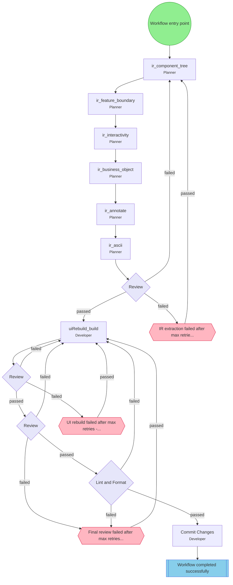

## Workflow: UI Reconstruction

Extract semantic IR from existing UI, rebuild from specification. Implements the 'Platonic Form' philosophy - capturing the essence (what) not the implementation (how).

### Diagram

### Step Instructions

| Stage | Step | Name | Agent | Instructions |
|-------|------|------|-------|--------------|
| semantic-ir-extraction | ir_component_tree | ir_component_tree | Planner | Extract UI component hierarchy with element types, nesting, and framework imports. Output: Component tree with semantic roles. |
| semantic-ir-extraction | ir_feature_boundary | ir_feature_boundary | Planner | Determine logical groupings of components that form discrete features. Output: Feature map with parent-child relationships. |
| semantic-ir-extraction | ir_interactivity | ir_interactivity | Planner | Document user interactions: click handlers, form submissions, state mutations, and data flow. Output: Interaction inventory. |
| semantic-ir-extraction | ir_business_object | ir_business_object | Planner | Identify domain entities displayed or manipulated by the UI and their CRUD operations. Output: Business object catalog. |
| semantic-ir-extraction | ir_annotate | ir_annotate | Planner | Overlay visual markers on screenshot identifying components, features, and interactions. Output: Annotated screenshot. |
| semantic-ir-extraction | ir_ascii | ir_ascii | Planner | Create text-based diagrams showing UI state transitions and user flows. Output: ASCII state machine diagram. |
| semantic-ir-extraction | ir_review | Review | Reviewer | Validate completeness and accuracy of Semantic IR against source UI. Criteria: All visible elements mapped, interactions documented. |
| ui-build-from-ir | uiRebuild_build | uiRebuild_build | Developer | Implement UI from Semantic IR specification, matching visual layout and behavior. Preserve semantic structure over visual mimicry. |
| ui-build-from-ir | uiRebuild_review | Review | Reviewer | Compare rebuilt UI against original screenshot and Semantic IR. Verify functional equivalence and semantic fidelity. |
| unbiased-review | final_review | Review | Reviewer | Verify rebuilt UI captures essential purpose (Platonic Form) not just appearance. Test: Could this IR reconstruct the UI in a different framework? |
| delivery | lint_format | Lint & Format | Developer | Run lint and format checks. Auto-fix issues where possible. |
| delivery | commit | Commit Changes | Developer | Commit all changes with a descriptive message |