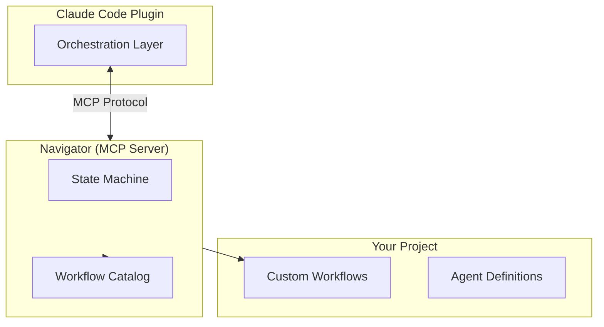

# Agent Toolkit

AI agent tools. Ships with **Navigator** (MCP server) and **Flow** (Claude Code plugin).

## Components

| Component                                                | Pattern              | Provides              |
| -------------------------------------------------------- | -------------------- | --------------------- |
| [Navigator](packages/agent-flow-navigator-mcp/README.md) | Finite State Machine | Workflow navigation   |
| [Flow](plugins/flow/README.md)                           | Prompt injection     | Orchestration ruleset |

**Inversion of control**: Traditional workflow engines use agents as tools. Navigator flips this - the AI orchestrator stays in control and uses the FSM for navigation.

## Installation

```bash
# Install Flow plugin (includes Navigator MCP)
claude plugin marketplace add leclabs/agent-toolkit
claude plugin install flow@agent-toolkit
```

## Quick Start (Flow)

```bash
/flow:task "add user authentication"
/flow:go
```

## Architecture



## Workflows

16 workflow templates in the catalog:

| Workflow                  | Purpose                                                   |
| ------------------------- | --------------------------------------------------------- |
| feature-development       | Full lifecycle: plan, implement, test, review, PR         |
| bug-fix                   | Reproduce, investigate, fix, regression test              |
| bug-hunt                  | Parallel investigation: reproduce, archaeology, forensics |
| quick-task                | Minimal: understand, execute, verify                      |
| agile-task                | General: analyze, implement, test, review                 |
| test-coverage             | Analyze gaps, write tests, review                         |
| refactor                  | Functional core / imperative shell restructuring          |
| ui-reconstruction         | Extract semantic IR, rebuild UI, blind review             |
| context-optimization      | Map connections, identify pathologies, improve            |
| build-review-murder-board | Build-review loop with 80% approval threshold             |
| build-review-quick        | Build-review loop with basic sanity check                 |
| batch-process             | Dynamic fork/join for processing multiple items           |
| context-gather            | Parallel context gathering                                |
| execute                   | Single-step: just do the thing                            |
| odd-even-test             | Test workflow demonstrating fork with retry logic         |
| hitl-test                 | Minimal HITL recovery test                                |

## License

ISC
