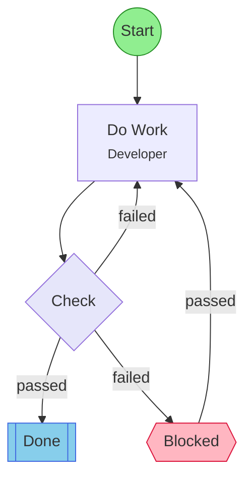
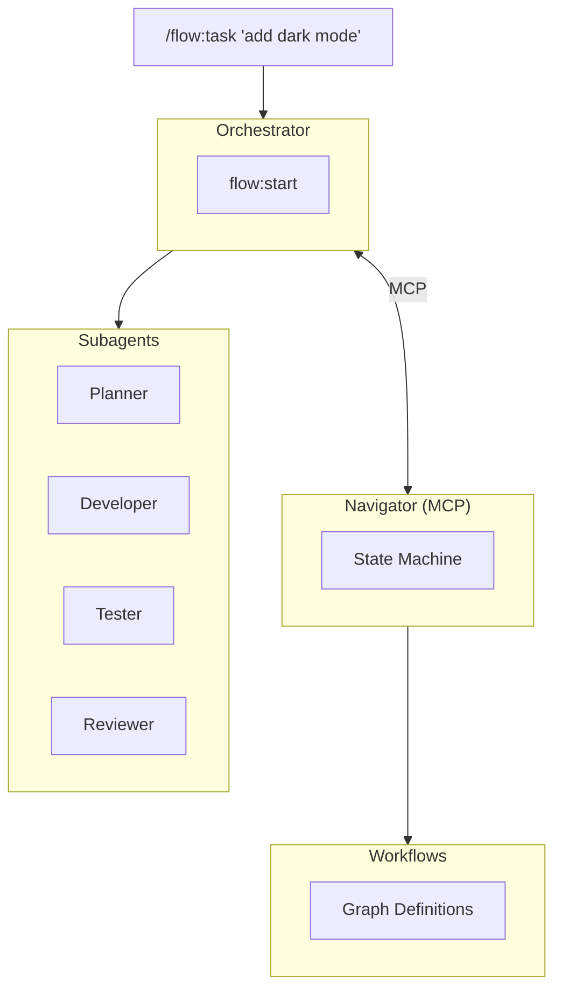

# Agent Toolkit

A Claude Code plugin marketplace for AI agent tools. The flagship plugin is **Flow** -- a stateless state-machine for Agents.

## Installation

```bash
# Add the toolkit to Claude Code
claude plugin marketplace add leclabs/agent-toolkit

claude plugin install flow@agent-toolkit
```



## Quick Start

```bash
# Create a task with a workflow
/flow:task "add user authentication"

# Execute all pending tasks
/flow:go
```

## Commands

| Command       | Description                                  |
| ------------- | -------------------------------------------- |
| `/flow:task`  | Create a task and choose a workflow          |
| `/flow:go`    | Execute all pending tasks                    |
| `/flow:recon` | Deep project reconnaissance                  |
| `/flow:list`  | List available workflows                     |
| `/flow:setup` | Set up workflows and agents for your project |

## Workflows

14 workflow templates ship in the catalog:

| Workflow                  | Steps | Description                                                        |
| ------------------------- | ----- | ------------------------------------------------------------------ |
| feature-development       | 15    | Full lifecycle: plan, implement, test, review, PR                  |
| bug-fix                   | 11    | Reproduce, investigate, fix, regression test                       |
| bug-hunt                  | 16    | Parallel investigation: reproduce, code archaeology, git forensics |
| agile-task                | 9     | General task: analyze, implement, test, review                     |
| quick-task                | 8     | Minimal: understand, execute, verify                               |
| test-coverage             | 10    | Analyze gaps, write tests, review                                  |
| context-gather            | 10    | Parallel context gathering: repo, system, weather                  |
| context-optimization      | 10    | Map connections, identify pathologies, improve                     |
| ui-reconstruction         | 17    | Extract semantic IR, rebuild UI, blind review                      |
| refactor                  | 16    | Functional core / imperative shell restructuring                   |
| build-review-murder-board | 7     | Build-review loop, level 5 scrutiny, blind-shot review             |
| build-review-quick        | 7     | Build-review loop, basic sanity check                              |
| execute                   | 3     | Single-step workflow: just do the thing                            |
| hitl-test                 | 5     | Minimal HITL recovery test: work, gate, escalate                   |

Customize workflows for your project with `/flow:setup`.

## Architecture



## Links

- [Flow Plugin](plugins/flow/README.md) -- commands, skills, workflows, and customization
- [Navigator MCP Server](packages/agent-flow-navigator-mcp/README.md) -- workflow state machine
- [Workflow Diagrams](.flow/diagrams/) -- mermaid diagrams for all workflows

## License

ISC
