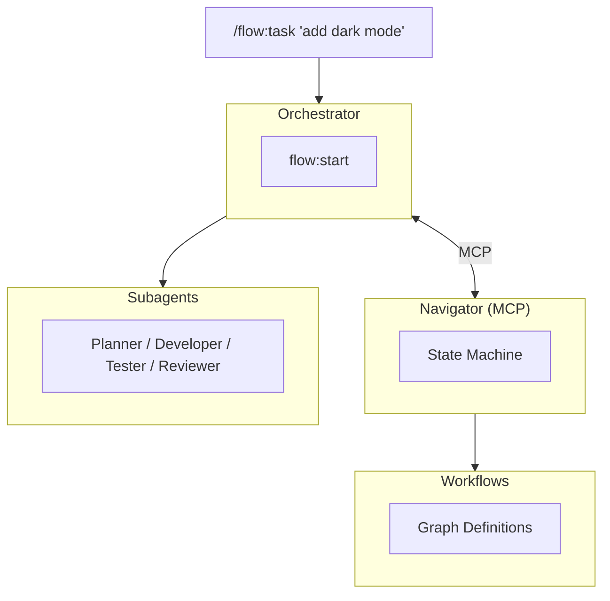

# Flow Plugin

Workflow orchestration for AI agents. Flow provides structured, repeatable workflows that guide agents through complex tasks with automatic retry handling and human-in-the-loop escalation.

## Overview

Flow turns unstructured agent requests into trackable, multi-step workflows. When you say `/flow:task "add user auth"`, Flow:

1. Presents available workflows for selection
2. Creates a task with workflow state
3. Guides agents through planning, implementation, testing, and delivery
4. Handles failures with retries and escalation

## Quick Start

```bash
# At session start, load the orchestrator context
/flow:start

# Create and run a task
/flow:task "add a new user profile feature..."
/flow:go
```

## Commands

| Command       | Description                         |
| ------------- | ----------------------------------- |
| `/flow:task`  | Create a task and choose a workflow |
| `/flow:go`    | Execute all pending flow tasks      |
| `/flow:recon` | Deep project reconnaissance         |

All 14 catalog workflows are available through `/flow:task` (interactive selection) or `/flow:task-create "description" <workflow-id>` (explicit).

## Skills

Skills are the internal orchestration interface used by the agent system:

| Skill                | Description                                            |
| -------------------- | ------------------------------------------------------ |
| `/flow:start`        | Load flow context; runs automatically at session start |
| `/flow:task-create`  | Create a new task with workflow tracking               |
| `/flow:task-list`    | List all flow tasks and their progress                 |
| `/flow:task-get`     | Get detailed task info with workflow diagram           |
| `/flow:task-advance` | Advance a task to the next step (passed/failed)        |
| `/flow:run`          | Execute tasks autonomously with subagent delegation    |
| `/flow:setup`        | Set up workflows and agents (interactive/intent/bulk)  |
| `/flow:list`         | List available workflows                               |
| `/flow:load`         | Load workflows (project reload or external plugin)     |
| `/flow:diagram`      | Generate mermaid diagram for a workflow                |
| `/flow:analyze`      | Interactive workflow discovery from project            |
| `/flow:validate`     | Static validation of workflow definitions              |
| `/flow:inspect`      | Inspect workflow or step details                       |
| `/flow:dry-run`      | Simulate workflow execution without side effects       |

## Workflows

14 workflows ship in the catalog. Each workflow is a graph of typed nodes connected by conditional edges, with retry logic and agent assignments.

### feature-development

Full lifecycle for building features. Includes planning review gates and code review. ([diagram](../../.flow/diagrams/feature-development.md))

**Stages:** planning &rarr; development &rarr; verification &rarr; delivery
**Steps:** parse_requirements &rarr; explore_codebase &rarr; create_plan &rarr; plan_review &rarr; implement &rarr; write_tests &rarr; run_tests &rarr; code_review &rarr; lint_format &rarr; commit &rarr; create_pr

### bug-fix

Structured bug fixing with reproduction and regression testing. ([diagram](../../.flow/diagrams/bug-fix.md))

**Stages:** investigation &rarr; development &rarr; verification &rarr; delivery
**Steps:** reproduce &rarr; investigate &rarr; write_fix &rarr; add_regression_test &rarr; verify_fix &rarr; lint_format &rarr; commit

### agile-task

General development tasks with review. ([diagram](../../.flow/diagrams/agile-task.md))

**Stages:** planning &rarr; development &rarr; verification &rarr; delivery
**Steps:** analyze &rarr; implement &rarr; test &rarr; review &rarr; lint_format &rarr; commit

### quick-task

Minimal workflow for small, straightforward tasks. No formal review gates. ([diagram](../../.flow/diagrams/quick-task.md))

**Stages:** planning &rarr; development &rarr; verification &rarr; delivery
**Steps:** understand &rarr; execute &rarr; verify &rarr; lint_format &rarr; commit

### test-coverage

Analyze coverage gaps and write tests to improve coverage. ([diagram](../../.flow/diagrams/test-coverage.md))

**Stages:** analysis &rarr; development &rarr; verification &rarr; delivery
**Steps:** analyze_coverage &rarr; identify_gaps &rarr; write_tests &rarr; run_tests &rarr; review &rarr; lint_format &rarr; commit

### context-optimization

Optimize agent context, instructions, and integration points. ([diagram](../../.flow/diagrams/context-optimization.md))

**Stages:** analysis &rarr; design &rarr; implementation &rarr; verification
**Steps:** map_connections &rarr; identify_pathologies &rarr; design_improvements &rarr; review_design &rarr; implement &rarr; verify

### ui-reconstruction

Reconstruct UI from screenshots or specifications using semantic intermediate representation. ([diagram](../../.flow/diagrams/ui-reconstruction.md))

**Stages:** semantic-ir-extraction &rarr; ui-build-from-ir &rarr; unbiased-review &rarr; delivery
**Steps:** ir_component_tree &rarr; ir_feature_boundary &rarr; ir_interactivity &rarr; ir_business_object &rarr; ir_annotate &rarr; ir_ascii &rarr; ir_review &rarr; uiRebuild_build &rarr; uiRebuild_review &rarr; final_review &rarr; lint_format &rarr; commit

### refactor

Intentional codebase restructuring following Functional Core / Imperative Shell principles. ([diagram](../../.flow/diagrams/refactor.md))

**Stages:** analysis &rarr; planning &rarr; development &rarr; verification &rarr; delivery
**Steps:** analyze_structure &rarr; identify_debt &rarr; classify_components &rarr; design_refactor &rarr; plan_review &rarr; extract_core &rarr; isolate_shell &rarr; write_tests &rarr; run_tests &rarr; code_review &rarr; lint_format &rarr; commit

### build-review-murder-board

Iterative build-review loop with level 5 scrutiny blind-shot review and 80% approval threshold. ([diagram](../../.flow/diagrams/build-review-murder-board.md))

**Stages:** development &rarr; verification &rarr; delivery
**Steps:** build &rarr; review &rarr; lint_format &rarr; commit

### build-review-quick

Iterative build-review loop with basic sanity check. ([diagram](../../.flow/diagrams/build-review-quick.md))

**Stages:** development &rarr; verification &rarr; delivery
**Steps:** build &rarr; review &rarr; lint_format &rarr; commit

### bug-hunt

Parallel investigation workflow: triage, then fork into reproduce, code archaeology, and git forensics before synthesizing findings. ([diagram](../../.flow/diagrams/bug-hunt.md))

**Stages:** planning &rarr; investigation (parallel) &rarr; development &rarr; verification &rarr; delivery
**Steps:** triage &rarr; fork(reproduce, code_archaeology, git_forensics) &rarr; synthesize &rarr; write_fix &rarr; add_regression_test &rarr; verify_fix &rarr; lint_format &rarr; commit

### context-gather

Parallel context gathering: fork into repo info, system info, and weather report before summarizing. ([diagram](../../.flow/diagrams/context-gather.md))

**Stages:** investigation (parallel) &rarr; planning
**Steps:** fork(repo_info, system_info, weather_info) &rarr; repo_analyze &rarr; summarize

### execute

Single-step workflow. Just do the thing. ([diagram](../../.flow/diagrams/execute.md))

**Steps:** execute

### hitl-test

Minimal workflow for testing HITL recovery: work, gate check, escalate if blocked. ([diagram](../../.flow/diagrams/hitl-test.md))

**Stages:** development &rarr; verification
**Steps:** work &rarr; check

## Customization

Copy workflows to your project for customization:

```bash
/flow:setup
```

This creates `.flow/workflows/` with editable workflow definitions. Navigator loads project workflows first, falling back to catalog defaults.

```
.flow/
└── workflows/
    ├── feature-development/
    │   ├── workflow.json
    │   └── {step}.md
    └── bug-fix/
        └── ...
```

After editing, reload with `/flow:load`.

## Architecture



- **Orchestrator**: Coordinates workflow execution, delegates to subagents
- **Navigator**: MCP server that evaluates workflow graphs and tracks state
- **Subagents**: Specialized agents for each role
- **Workflows**: Definitions with nodes, edges, and retry logic

## Subagents

Flow delegates work to specialized subagents:

| Agent            | Role                                      |
| ---------------- | ----------------------------------------- |
| Planner          | Parse requirements, explore code, plan    |
| Developer        | Write code, fix issues, commit            |
| Tester           | Write tests, run tests, verify            |
| Reviewer         | Review plans and code                     |
| Investigator     | Reproduce bugs, find root causes          |
| Context Engineer | Optimize context, analyze documentation   |
| Architect        | Design system architecture, review builds |

## Human-in-the-Loop (HITL)

When retries are exhausted at a gate step, Flow escalates to HITL:

```
hitl: #1 Add user auth (direct)
  -> feature-development / verification
  -> hitl_impl_failed / pending

Reason: Max retries exceeded at code_review
Action: Fix manually, then /flow:task-advance 1 passed
```

## Further Reading

- [Navigator MCP Server](../../packages/agent-flow-navigator-mcp/README.md) - Workflow state machine
- [Workflow Catalog](../../packages/agent-flow-navigator-mcp/catalog/workflows/) - Built-in workflow definitions
- [Workflow Diagrams](../../.flow/diagrams/) - Mermaid diagrams for all workflows
