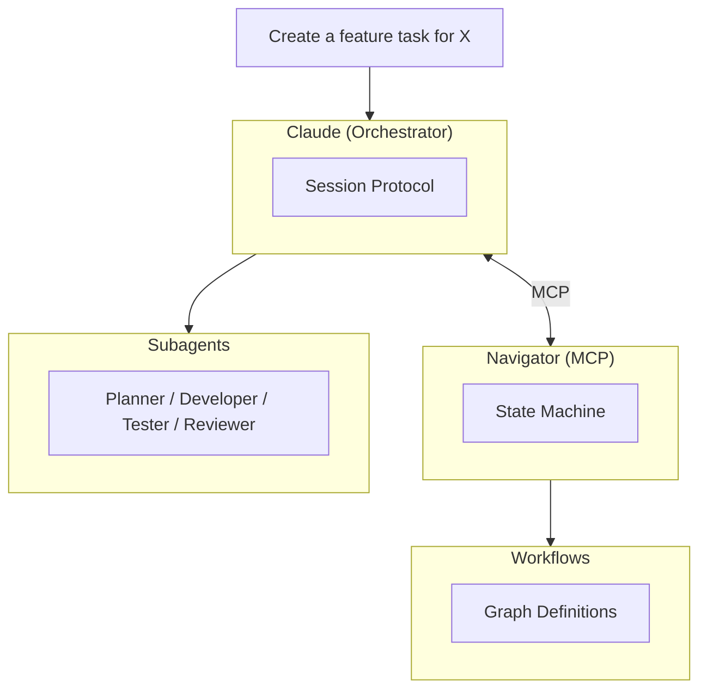

# Flow Plugin

Workflow orchestration for AI agents. Flow provides structured, repeatable workflows that guide agents through complex tasks with automatic retry handling and human-in-the-loop escalation.

## Overview

Flow turns unstructured agent requests into trackable, multi-step workflows. The plugin injects orchestration context at session start, enabling Claude to coordinate workflow execution using native Task tools and Navigator MCP directly.

## Quick Start

Flow context is automatically injected at session start. Just ask Claude to create a task:

```
Create a feature-development task for adding user authentication
```

Claude will:

1. Call `TaskCreate` to create a tracked task
2. Call `Start` to initialize workflow state
3. Execute the workflow loop (`Current` → work → `Next`), delegating to subagents
4. Advance through steps until completion or HITL

## How It Works

The session-start hook teaches Claude the orchestration protocol:

1. **TaskCreate** - Create a task with metadata
2. **Start** - Initialize workflow state on a task
3. **Current** - Read current workflow position
4. **Next** - Advance based on step outcome
5. **Task** - Delegate to subagents (Planner, Developer, Tester, etc.)
6. **TaskUpdate** - Track progress

Navigator MCP provides the workflow state machine. Claude calls it directly—no intermediate skill layer.

## Available Workflows

14 workflows ship in the catalog:

| Workflow                  | Purpose                                                     |
| ------------------------- | ----------------------------------------------------------- |
| feature-development       | Full lifecycle for building features                        |
| bug-fix                   | Structured bug fixing with regression testing               |
| bug-hunt                  | Parallel investigation (reproduce, archaeology, forensics)  |
| agile-task                | General development tasks with review                       |
| quick-task                | Minimal workflow for small tasks                            |
| test-coverage             | Analyze gaps and improve test coverage                      |
| refactor                  | Codebase restructuring (Functional Core / Imperative Shell) |
| ui-reconstruction         | Reconstruct UI from screenshots                             |
| context-optimization      | Optimize agent context and instructions                     |
| build-review-murder-board | Iterative build with 80% approval threshold                 |
| build-review-quick        | Iterative build with basic sanity check                     |
| context-gather            | Parallel context gathering                                  |
| execute                   | Single-step: just do the thing                              |
| hitl-test                 | Minimal workflow for testing HITL recovery                  |

Use `ListWorkflows()` to see available workflows, `Diagram(workflowType)` to visualize.

## Workflow Diagrams

- [feature-development](../../.flow/diagrams/feature-development.md)
- [bug-fix](../../.flow/diagrams/bug-fix.md)
- [bug-hunt](../../.flow/diagrams/bug-hunt.md)
- [agile-task](../../.flow/diagrams/agile-task.md)
- [quick-task](../../.flow/diagrams/quick-task.md)
- [test-coverage](../../.flow/diagrams/test-coverage.md)
- [refactor](../../.flow/diagrams/refactor.md)
- [ui-reconstruction](../../.flow/diagrams/ui-reconstruction.md)
- [context-optimization](../../.flow/diagrams/context-optimization.md)
- [build-review-murder-board](../../.flow/diagrams/build-review-murder-board.md)
- [build-review-quick](../../.flow/diagrams/build-review-quick.md)
- [context-gather](../../.flow/diagrams/context-gather.md)
- [execute](../../.flow/diagrams/execute.md)
- [hitl-test](../../.flow/diagrams/hitl-test.md)

## Architecture



- **Orchestrator**: Claude coordinates workflow execution using injected protocol
- **Navigator**: MCP server that evaluates workflow graphs and tracks state
- **Subagents**: Specialized agents for each role (via Task tool)
- **Workflows**: Graph definitions with nodes, edges, and retry logic

## Subagents

Flow delegates work to specialized subagents via Claude's Task tool:

| Agent            | Role                                           |
| ---------------- | ---------------------------------------------- |
| Planner          | Parse requirements, explore code, create plans |
| Developer        | Write code, fix issues, implement features     |
| Tester           | Write tests, run tests, verify behavior        |
| Reviewer         | Review plans and code for quality              |
| Investigator     | Reproduce bugs, trace issues, find root causes |
| Context Engineer | Optimize context, analyze documentation        |
| Architect        | Design system architecture, review builds      |

## Human-in-the-Loop (HITL)

When retries are exhausted at a gate step, Flow escalates to HITL:

```
HITL: Task #1 "Add user auth"
  Workflow: feature-development
  Step: code_review (failed)
  Retries: 2/2 exhausted

Reason: Code review failed after max retries
Action: Fix manually, then advance with Next(taskFilePath, result: "passed")
```

## Customization

Copy workflows to your project for customization:

```
CopyWorkflows(workflowIds: ["feature-development", "bug-fix"])
```

This creates `.flow/workflows/` with editable workflow definitions. Navigator loads project workflows first, falling back to catalog defaults.

## Further Reading

- [Navigator MCP Server](../../packages/agent-flow-navigator-mcp/README.md) - Workflow state machine
- [Workflow Catalog](../../packages/agent-flow-navigator-mcp/catalog/workflows/) - Built-in workflow definitions
