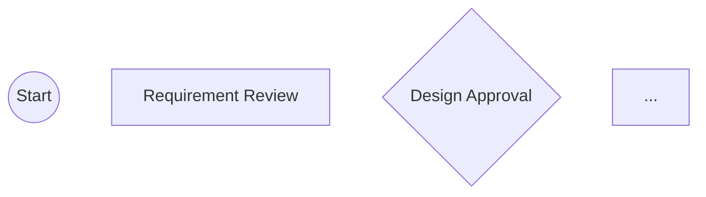

# /flow:analyze

Discover workflows from your project's existing processes, diagrams, and documentation.

## Philosophy

- **Collaborative discovery** - Guide users through findings, don't dump everything at once
- **One screen at a time** - Present findings incrementally with focused questions
- **Project-native** - Use YOUR terminology from diagrams and docs, not generic names
- **Low cognitive load** - Summarize, ask, confirm at each step

## Usage

```
/flow:analyze              # Full interactive discovery
/flow:analyze --quick      # Fast scan, minimal interaction
```

## What To Do

### Phase 1: Initial Exploration

Use the Task tool with Explore subagent to scan the project:

````
Task(
  subagent_type: "Explore",
  prompt: """
    Scan this project for workflow-related artifacts. Return structured findings.

    ## Search Targets

    1. **CI/CD Configurations**
       - .github/workflows/*.yml
       - .gitlab-ci.yml
       - Jenkinsfile
       - .circleci/config.yml
       - azure-pipelines.yml

    2. **Documentation with Processes**
       - CONTRIBUTING.md
       - DEVELOPMENT.md
       - docs/*.md
       - README.md (look for "How to contribute" or "Development" sections)

    3. **Mermaid Diagrams** (high value!)
       - Search for ```mermaid blocks in all .md files
       - Extract: flowchart, sequenceDiagram, stateDiagram

    4. **GitHub/GitLab Templates**
       - .github/PULL_REQUEST_TEMPLATE.md
       - .github/ISSUE_TEMPLATE/*.md
       - .gitlab/merge_request_templates/*.md

    5. **Build & Task Scripts**
       - package.json scripts
       - Makefile targets
       - scripts/ directory

    ## Output Format

    Return JSON:
    {
      "cicd": [{"path": "...", "type": "github-actions", "jobs": [...]}],
      "docs": [{"path": "...", "hasProcess": true, "sections": [...]}],
      "diagrams": [{"path": "...", "type": "flowchart", "rawContent": "...", "steps": [...]}],
      "templates": [{"path": "...", "type": "pr-template", "checklist": [...]}],
      "scripts": [{"name": "...", "command": "..."}]
    }
  """
)
````

### Phase 2: Present Findings (One Category at a Time)

After exploration, present findings incrementally. Do NOT dump all findings at once.

**If mermaid diagrams found (highest value):**

```
AskUserQuestion(
  question: "I found workflow diagrams in your project. Want me to build flows from these?",
  options: [
    {"label": "docs/development.md - Feature Flow", "description": "7-step feature workflow with review gates"},
    {"label": "docs/ci.md - Deploy Pipeline", "description": "Build -> Test -> Stage -> Production"},
    {"label": "Skip diagrams", "description": "Look at other patterns instead"}
  ],
  multiSelect: true
)
```

**If CI/CD configs found:**

```
AskUserQuestion(
  question: "Your CI/CD pipeline has clear stages. Create a workflow from it?",
  options: [
    {"label": "Yes - Use CI stages as workflow steps", "description": "lint -> test -> build -> deploy"},
    {"label": "No - Just for reference", "description": "I'll name steps myself"}
  ]
)
```

**If PR templates with checklists found:**

```
AskUserQuestion(
  question: "Your PR template has a checklist. Use these as verification steps?",
  options: [
    {"label": "Yes - Add as gate steps", "description": "Tests pass, Docs updated, No console.logs"},
    {"label": "Partial - Let me pick which ones", "description": "Show me the list"},
    {"label": "No", "description": "Skip PR template"}
  ]
)
```

### Phase 3: Diagram Mining (Key Feature)

When mermaid diagrams are selected, parse them for workflow structure:

````
Task(
  subagent_type: "Explore",
  prompt: """
    Parse this mermaid diagram and extract workflow structure:

    ```mermaid
    {diagram content}
    ```

    Extract:
    1. Step names (use their exact terminology!)
    2. Transitions between steps
    3. Decision points / gates
    4. Success/failure paths

    Return JSON:
    {
      "steps": [
        {"id": "requirement_review", "name": "Requirement Review", "type": "task"},
        {"id": "design_approval", "name": "Design Approval", "type": "gate"}
      ],
      "transitions": [
        {"from": "requirement_review", "to": "design_approval", "on": "passed"}
      ],
      "terminology": {
        "noteworthy": ["They call it 'Requirement Review' not 'Parse Requirements'"]
      }
    }
  """
)
````

### Phase 4: Workflow Assembly

For each discovered workflow pattern, confirm the structure:

```
AskUserQuestion(
  question: "Here's the workflow I extracted from 'docs/feature-flow.md'. Look right?",
  options: [
    {
      "label": "Looks good!",
      "description": "Create workflow with these 7 steps"
    },
    {
      "label": "Need to adjust",
      "description": "Let me modify steps before creating"
    },
    {
      "label": "Start over",
      "description": "This isn't what I want"
    }
  ]
)
```

**If user wants adjustments:**

Present editable step list:

```markdown
## Proposed Steps for "Feature Development"

| #   | Step Name          | Type | Agent     | Keep? |
| --- | ------------------ | ---- | --------- | ----- |
| 1   | Requirement Review | task | Planner   | Yes   |
| 2   | Design Approval    | gate | Reviewer  | Yes   |
| 3   | Implementation     | task | Developer | Yes   |
| 4   | Code Review        | gate | Reviewer  | Yes   |
| 5   | QA Testing         | task | Tester    | Yes   |

**What would you like to change?**
```

```
AskUserQuestion(
  question: "Select steps to modify or remove:",
  options: [
    {"label": "Add step", "description": "Insert a new step"},
    {"label": "Remove step", "description": "Delete a step from the list"},
    {"label": "Rename step", "description": "Change step name or ID"},
    {"label": "Change agent", "description": "Assign different agent to a step"},
    {"label": "Done editing", "description": "Proceed with current steps"}
  ]
)
```

### Phase 5: Agent Assignment

For each step, confirm agent assignment:

```
AskUserQuestion(
  question: "Who should handle 'Implementation'?",
  options: [
    {"label": "@flow:Developer", "description": "Writes code, runs tests"},
    {"label": "@flow:Planner", "description": "Creates plans, explores codebase"},
    {"label": "@flow:Tester", "description": "Writes and runs tests"},
    {"label": "@flow:Reviewer", "description": "Reviews code and plans"},
    {"label": "Direct (no agent)", "description": "Orchestrator handles directly"}
  ]
)
```

Or batch assignment for efficiency:

```markdown
## Agent Assignments

I'll use these default assignments based on step types:

| Step Type         | Default Agent   |
| ----------------- | --------------- |
| Planning/Analysis | @flow:Planner   |
| Implementation    | @flow:Developer |
| Testing           | @flow:Tester    |
| Review/Gate       | @flow:Reviewer  |
```

```
AskUserQuestion(
  question: "Use these default agent assignments?",
  options: [
    {"label": "Yes - Use defaults", "description": "Standard agent mapping"},
    {"label": "No - Let me assign each", "description": "Custom agent selection per step"}
  ]
)
```

### Phase 6: Generate Workflow JSON

Build the workflow.json matching project terminology:

```json
{
  "id": "feature-development",
  "name": "Feature Development",
  "description": "Extracted from docs/feature-flow.md",
  "nodes": {
    "start": {
      "type": "start",
      "name": "Start"
    },
    "requirement_review": {
      "type": "task",
      "name": "Requirement Review",
      "description": "Review and clarify requirements",
      "agent": "Planner",
      "stage": "planning"
    }
  },
  "edges": [
    { "from": "start", "to": "requirement_review" },
    { "from": "requirement_review", "to": "design_approval", "on": "passed" }
  ]
}
```

### Phase 7: Save Workflow

```
AskUserQuestion(
  question: "Save this workflow?",
  options: [
    {"label": "Save to .flow/workflows/", "description": "Ready to use with /flow:task-create"},
    {"label": "Show JSON only", "description": "Copy manually"},
    {"label": "Discard", "description": "Don't save"}
  ]
)
```

**If saving:**

1. Create directory: `.flow/workflows/{workflow-id}/`
2. Write `workflow.json`
3. Generate `README.md` with diagram
4. Call `Navigator.ListWorkflows` to reload

````markdown
## Workflow Created

Saved to `.flow/workflows/feature-development/`


````

**Next steps:**

- Create a task: `/flow:task-create "description" feature-development`
- View workflow: `/flow:diagram feature-development`
- Edit: `.flow/workflows/feature-development/workflow.json`

```

## Quick Mode (--quick)

Skip interactive confirmations:

1. Scan project (same as Phase 1)
2. Auto-select highest-confidence patterns
3. Generate workflow with default agents
4. Show summary and ask single confirmation before saving

```

AskUserQuestion(
question: "Quick analysis found 2 potential workflows. Create them?",
options: [
{"label": "Create both", "description": "feature-flow (7 steps), deploy-pipeline (4 steps)"},
{"label": "Review first", "description": "Switch to interactive mode"},
{"label": "Cancel", "description": "Don't create workflows"}
]
)

````

## When No Patterns Found

```markdown
## No Workflow Patterns Found

I didn't find:
- Mermaid diagrams in markdown files
- CI/CD configurations
- PR/Issue templates with checklists
- Process documentation

**Options:**
1. Use a catalog workflow: `/flow:init`
2. Describe your workflow and I'll help build it
3. Point me to specific files to analyze
````

```
AskUserQuestion(
  question: "How would you like to proceed?",
  options: [
    {"label": "Use catalog workflows", "description": "Start with pre-built templates"},
    {"label": "Describe my workflow", "description": "I'll tell you the steps"},
    {"label": "Analyze specific file", "description": "Point to a file with process info"}
  ]
)
```

## Output Artifacts

When workflow is created, generate:

1. **workflow.json** - The executable workflow definition
2. **README.md** - Human-readable description with mermaid diagram
3. **Source reference** - Comment noting which file/diagram it came from

```json
{
  "id": "feature-development",
  "name": "Feature Development",
  "description": "Extracted from docs/feature-flow.md",
  "source": {
    "file": "docs/feature-flow.md",
    "type": "mermaid-diagram"
  }
}
```
