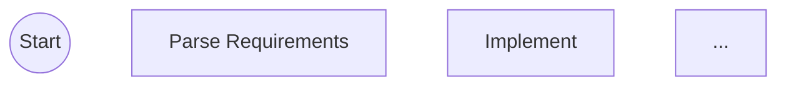

# /flow:task-get

Show detailed status for a specific flow task.

## Usage

```
/flow:task-get <taskId>
```

## What To Do

### 1. Get Task Details

Call `TaskGet(taskId)` to get the task with its `metadata.navigator`.

### 2. Get Current Step State

Call `Navigator.Navigate` with workflowType and currentStep (no result = get current state):

```json
{
  "workflowType": "feature-development",
  "currentStep": "implement"
}
```

Returns: `currentStep`, `stage`, `subagent`, `stepInstructions`, `terminal`, `subjectSuffix`, `action`.

### 3. Generate Diagram

Call `Navigator.Diagram` with current position highlighted:

```json
{
  "workflowType": "feature-development",
  "currentStep": "implement"
}
```

### 4. Display Results

````markdown
## Task: task-123 "Implement feature X"

**Status:** in_progress
**Workflow:** feature-development
**Current step:** implement (stage: development, step: code)
**Subagent:** @flow:developer
**Priority:** 75

### Progress


````

### Context

- **Title:** Implement feature X
- **Description:** Add user authentication with OAuth
- **Last Output:** "Plan approved, ready for implementation"

### Next Action

Delegate to @flow:developer using Task tool:

```
Task(subagent_type: "general-purpose", prompt: "...")
```

Then call: `/flow:task-advance task-123 <passed|failed> "summary"`

````

## If No Subagent

When `metadata.navigator.subagent` is null:

```markdown
### Next Action

This step should be handled directly (no subagent delegation needed).

When complete: `/flow:task-advance task-123 <passed|failed> "summary"`
````

## Task Not Found

```
Task 'task-xyz' not found or is not a flow task.

Use `/flow:task-list` to see available tasks.
```

## Extracting Information

```javascript
const task = await TaskGet(taskId);
const nav = task.metadata?.navigator;

if (!nav) {
  // Not a flow task - check subject for [flow] prefix
  return;
}

// Metadata stores minimal state
const stored = {
  workflowType: nav.workflowType,
  currentStep: nav.currentStep,
  retryCount: nav.retryCount || 0,
};

// Call Navigate to get current step details (subagent, stage, stepInstructions)
const current = await Navigate({
  workflowType: stored.workflowType,
  currentStep: stored.currentStep,
});

const info = {
  id: task.id,
  subject: task.subject,
  status: task.status,
  workflow: stored.workflowType,
  currentStep: current.currentStep,
  stage: current.stage,
  subagent: current.subagent,
  stepInstructions: current.stepInstructions,
};
```
