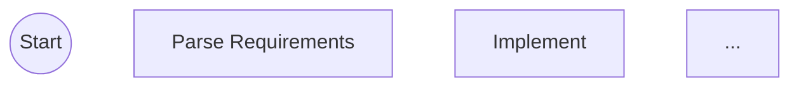

# /flow:task-get

Show detailed status for a specific flow task.

## Usage

```
/flow:task-get <taskId>
```

## What To Do

### 1. Read Task File

Read the task file directly to get all metadata:

```javascript
const taskFilePath = `.claude/todos/${taskId}.json`;
const task = readFile(taskFilePath);
```

Task structure:
```json
{
  "id": "1",
  "subject": "Add user authentication",
  "description": "...",
  "status": "in_progress",
  "metadata": {
    "userDescription": "Add user authentication with OAuth",
    "workflowType": "feature-development",
    "currentStep": "implement",
    "retryCount": 0
  }
}
```

### 2. Get Current Step State

Call `Navigator.Navigate` with taskFilePath (no result = get current state):

```json
{
  "taskFilePath": ".claude/todos/1.json"
}
```

Returns: `currentStep`, `stage`, `subagent`, `stepInstructions`, `terminal`, `orchestratorInstructions`, `metadata`.

### 3. Generate Diagram

Call `Navigator.Diagram` with current position highlighted:

```json
{
  "workflowType": "feature-development",
  "currentStep": "implement"
}
```

### 4. Display Results

Use standard flow task format with diagram:

````markdown
#1 Implement feature X (@flow:Developer)
 → feature-development · development
 → implement · in_progress



**Description:** Add user authentication with OAuth

**Next:** Delegate to @flow:Developer, then `/flow:task-advance 1 <passed|failed>`
````

## If No Subagent

When Navigate returns `subagent: null`, show `(direct)` instead:

```
#1 Review changes (direct)
 → feature-development · verification
 → code_review · in_progress

**Next:** Handle step directly, then `/flow:task-advance 1 <passed|failed>`
```

## Task Not Found

```
Task '123' not found or is not a flow task.

Use `/flow:task-list` to see available tasks.
```

## Identifying Flow Tasks

Flow tasks have metadata with `workflowType`:

```javascript
// Flow task - has workflow metadata
{
  "metadata": {
    "workflowType": "feature-development",
    "currentStep": "implement"
  }
}

// Regular task - no workflow metadata
{
  "metadata": {}  // or no metadata at all
}
```
